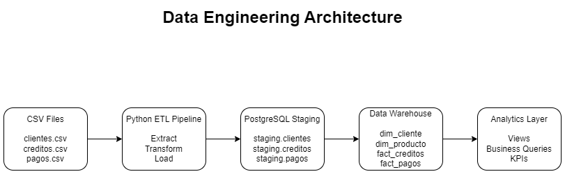
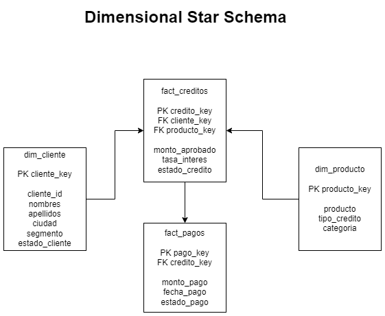

# Data Engineering Technical Challenge

## Overview

This project implements an end-to-end Data Engineering solution for processing financial data related to customers, loans, and payments.

The pipeline ingests CSV files, performs data transformations and validations, loads the information into a PostgreSQL staging layer, and builds a dimensional Data Warehouse model optimized for analytical workloads.

The solution includes:

- CSV ingestion
- Data transformation and cleansing
- PostgreSQL staging layer
- Dimensional Data Warehouse modeling
- Analytical SQL views
- Business-oriented analytical queries
- Data quality validations
- Dockerized local environment
- Modular ETL architecture

---

# Solution Architecture

CSV Files  
↓  
Python ETL Pipeline  
↓  
PostgreSQL Staging Layer  
↓  
Dimensional Data Warehouse  
↓  
Analytical Views & Business Queries

---

# Architecture Diagram



---

# Tech Stack

- Python
- Pandas
- PostgreSQL
- SQLAlchemy
- Docker
- DBeaver
- Git & GitHub

---

# Project Structure

```bash
data-engineer/
│
├── data/
│   └── raw/
│
├── docs/
│   ├── architecture.png
│   ├── star_schema.png
│   └── screenshots/
│
├── sql/
│   ├── ddl/
│   │   ├── staging.sql
│   │   ├── dwh.sql
│   │   └── views.sql
│   │
│   └── analytics/
│       ├── business_queries.sql
│       └── data_quality_checks.sql
│
├── src/
│   ├── extract/
│   ├── transform/
│   ├── load/
│   └── main.py
│
├── docker-compose.yml
├── requirements.txt
├── .env
└── README.md
```

---

# Data Sources

The solution processes three datasets:

- Customers
- Loans
- Payments

---

# ETL Pipeline

## Extract

CSV files are extracted using Pandas.

## Transform

Transformation and cleansing steps include:

- Column normalization
- Invalid date handling
- Data type corrections
- Null filtering
- Basic data validation

## Load

Cleaned datasets are loaded into PostgreSQL staging tables before being transformed into dimensional models.

---

# Staging Layer

The staging layer stores raw and partially cleansed data from source systems.

Implemented staging tables:

- staging.clientes
- staging.creditos
- staging.pagos
- staging.error_records

---

# Data Warehouse Model

The solution implements a dimensional star schema optimized for analytical querying.

## Dimensions

- dim_cliente
- dim_producto

## Fact Tables

- fact_creditos
- fact_pagos

---

# Star Schema Diagram



---

# Analytical Views

The following analytical views were implemented:

- vw_cartera_total
- vw_pagos_metodo
- vw_creditos_ciudad
- vw_clientes_segmento
- vw_clientes_activos
- vw_creditos_aprobados
- vw_promedio_pagos

---

# Business Queries

The project includes analytical SQL queries such as:

- Top customers by approved amount
- Portfolio distribution by city
- Payment status distribution

---

# Data Quality Checks

Implemented validations include:

- Duplicate customer detection
- Loans without valid customers
- Payments without valid loans
- Invalid date validation

The project intentionally preserves raw inconsistencies at the staging layer while enforcing cleaner dimensional relationships in the Data Warehouse model.

---

# How to Run

## 1. Create virtual environment

```bash
python -m venv venv
```

## 2. Activate virtual environment

### Windows

```bash
.\venv\Scripts\Activate.ps1
```

## 3. Install dependencies

```bash
pip install -r requirements.txt
```

## 4. Start PostgreSQL container

```bash
docker compose up -d
```

## 5. Execute ETL pipeline

```bash
python -m src.main
```

---

# Current Features

- Dockerized PostgreSQL environment
- Modular ETL pipeline
- Staging layer implementation
- Star schema implementation
- Analytical SQL layer
- Data quality validations
- Git version control

---

# Future Improvements

Potential enhancements include:

- Airflow orchestration
- Incremental data loads
- Logging framework
- Unit testing
- CI/CD integration
- Cloud migration architecture

---

# Evidence

Project execution screenshots and supporting documentation are stored in:

```bash
docs/screenshots/
```

---

# Author

Julian Gomez